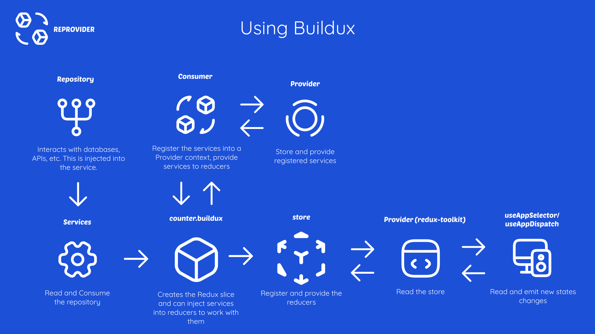

# Overview

What is buildux?

Buildux is a slice builder that allows inject services into reducers and thunks creating a context and consume services from reducers easy. It works with redux-toolkit library.

### How Buildux Works

You can review the next graph for understand the buildux flow

# Buildux Examples

You can view the examples with buildux and thunks [here](https://github.com/Lopez15-Hub/reprovider/tree/master/examples)
