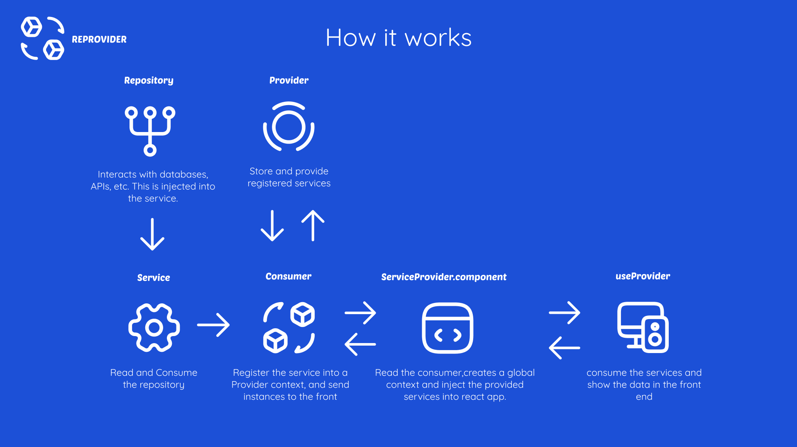

# Overview

## What is Reprovider?

Reprovider is minimalist package created created for manage services using depedency injection easly and quickly.

When our react app is scaling sometimes is necessary that we organize the logic for get a better understanding of our code.

Reprovider is designed for developers that want get a quickly and organized service provider in a react application using techniques like the Dependency Injection very simple.

With reprovider we can create services and consume into a component or outside of it.

Reprovider supports Redux for inject services into reducers and thunks. 

## How it works

